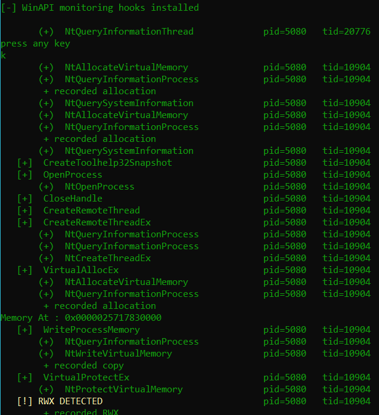
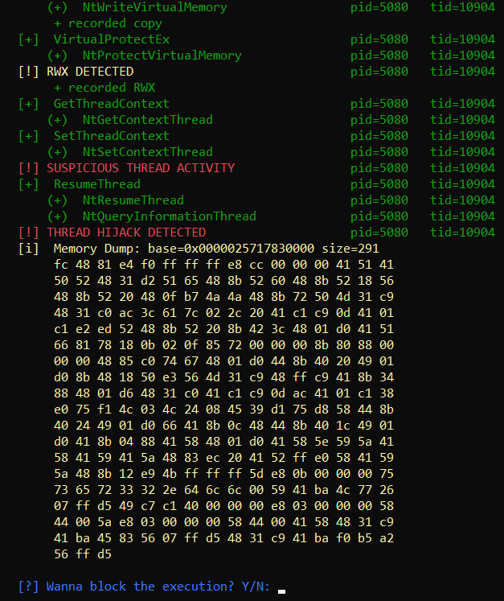
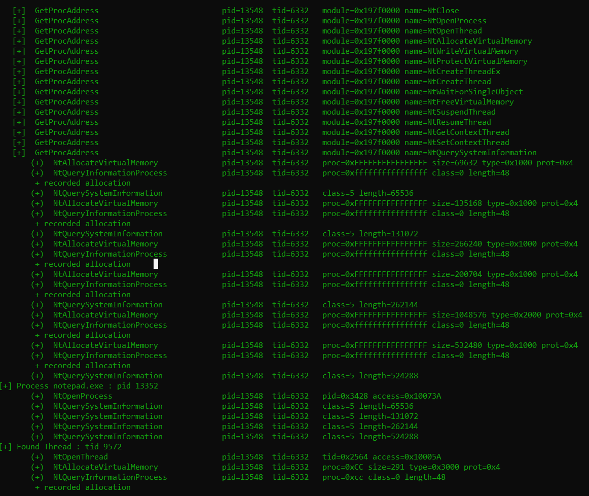
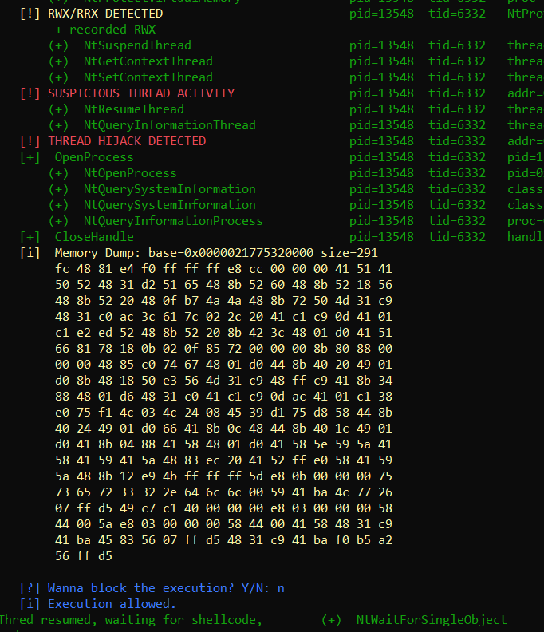
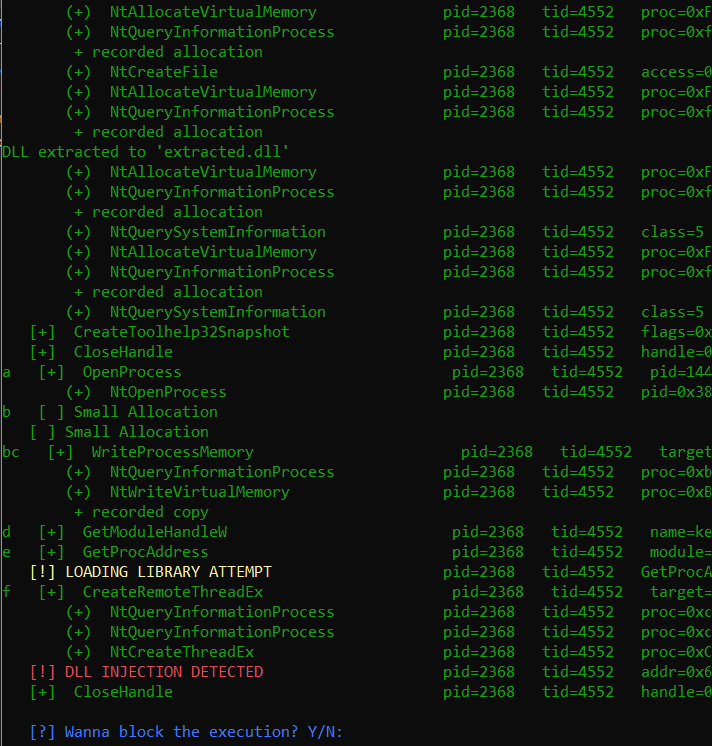

# Multi Api Hook Dll
Simple Antivirus DLL that when injected into a malware will hook WinApi and Native api functions through minook, track suspicious patterns and stop potentially malicious code; currently focused on Windows x64. 

Successfully detects most of my malware, such as [this](https://github.com/Hue-Jhan/Self-Injection-Reverse-Shell-Undetected), [this](https://github.com/Hue-Jhan/Encrypted-Trojan-Undetected), [this](https://github.com/Hue-Jhan/Local-Process-injection-Trojan), [this](https://github.com/Hue-Jhan/Remote-Dll-injector-Trojan), [this](https://github.com/Hue-Jhan/Ntdll-Process-inj-Trojan), [this](https://github.com/Hue-Jhan/Thread-Hijacking-Collection), [this](https://github.com/Hue-Jhan/Ntdll-Dll-Injection-Trojan) and [this](https://github.com/Hue-Jhan/Ntdll-Thread-Hijacking-trojan), but because it operates at usermode it cannot detect syscall injections (like [this](https://github.com/Hue-Jhan/Direct-Syscall-Process-Injection-Trojan) or [this](https://github.com/Hue-Jhan/Direct-Syscall-Dll-Injection)) since raw syscall tracking would require kernel-mode instrumentation which i cant do.

**Index**:

1. [⚓ Hooks explained](#hooks)
2. [💻 Code](#code)
   
   2.1 [How to use & Project Structure](#Howto)
   
   2.2 [In Depth Explanation](#expl)  
4. [👾 Malware Detection](#malw)


<a name="hooks">


# ⚓ 1 - Hooks

Hooks basically allow the DLL to intercept calls before the target function executes, when a hooked API is called, control is redirected to a custom detour function, which can inspect arguments, analyze behavior, log events, or block execution. Specifically, MinHook performs inline hooking by rewriting the first bytes of a target function with a jump instruction (trampoline). The original bytes are preserved in a function so the hook can safely pass execution back to the real API after processing. Here's an example of detecting [this](https://github.com/Hue-Jhan/Thread-Hijacking-Collection/tree/main/2_Create_Hijack) ---> 

This DLL applies hooks with minhook to a wide range of functions at both the WinAPI and their Native API (Nt/Zw) counterpart (E.g VirtualAlloc -> NtAllocateVirtualMemory), including but not limited to:


- Memory allocation: VirtualAlloc, VirtualAllocEx, VirtualProtect, VirtualProtectEx;
  
- Memory management: WriteProcessMemory, Memcpy, Manual copying;
  
- Threading: CreateThread, CreateRemoteThread, NtResumeThread, NtSetContextThread, SuspendThread;
  
- Module/Dll loading: LoadLibraryA/W, LdrLoadDll, GetProcAddress, Manual Mapping; 

- File manipulation: CreateFileA/W, and more, useful in case a dll/persistence file is dropped;

  
- And many more, for the full list check out ```nt_hooks.cpp``` and ```hook_stuff.cpp```.
  
Each nt hook also logs function parameters, memory addresses, and patterns such as RWX allocations, thread hijacking, and remote module injection. Some hooks also **block** execution if malicious behavior is detected, dump the memory region of the alleged payload and prompt the user with a simple question: "Do you want to block the execution?", if the answer is no, the malware will go on, else it will stop (and most likely crash or end execution). 

</a>


<a name="code">

# 💻 2 - Code

This project includes not only the hook dll, but also a starter file and some malware samples you can try.


<a name="Howto">

### 2.1 - How to use

Here's how to use the tools once you compile the starter and the hook (with [minhook VC17](https://github.com/TsudaKageyu/minhook/tree/master/build) library in a ```lib``` folder):

1) Use the ```starter.exe``` file to start a malware as a suspended process with ```./starter.exe malware.exe```, do not close the console;
2) Inject the Dll into the malware and wait until all the hooks are placed (couple of seconds);
3) Launch the process that the malware will target (if necessary);
4) Go back to the starter console and press ```Enter``` to resume the malware;
5) Get hacked (xd).

You can inject the dll in various ways, the simplest one in my opinion is to use Process hacker 2 (not the latest version known as System Informer), to do this simply open ProcHack, find the malware (harmless bc in a suspended state), right click, misc, inject dll. You can alternatively use a custom injector but this is imo the fastest way. Some Antiviruses might remove ProcHacker so add it to the exceptions if necessary. 

Most malware in their initial stage act as remote process injectors, they target softwares with AV/Edr exceptions or sometimes well known processes that are usually not suspicious and always active like explorer.exe or some windows internal services. All the malware samples in the zip file are process injectors that target notepad and inject shellcode (or a dll) that pops up a simple messagebox saying "xd". 

If you want to hook a DLL you can too, the ```dll-inj-xd.exe``` or whatever i named it is a simple remote dll injector that uses LoadLibraryA to inject a dll that acts as a self injector, targeting the process it's being loaded into to inject shellcode and pop up a msgbox. In order to hook it you must first spawn the malware as suspended, then spawn the targetes process (notepad), hook it with procHacker, then hook the injector too (in case you wanna hook them both), and resume it. The hook dll will recognize and stop the injector first (but you can choose not to stop the execution), then it will stop the malicious dll inside notepad, you can choose not to stop the injection here too.

The **starter file** is a very simple executable that given an executable it will start it as a suspended process, then by pressing enter the process will resume. In my opinion this starter file is fundamental to properly hook all functions before execution and to avoid race conditions. You can try to hook the malware while it's running but it might crash or simply already have done some damage.

The code for the **hook** is divided into these sections. The 2 images below are an example of the hook detecting [this](https://github.com/Hue-Jhan/Ntdll-Thread-Hijacking-trojan).



- ```dll_main.cpp```: entry point and hook installer using MinHook, installs all hooks when the DLL is injected and resizes console;

- ```hook_stuff.cpp / hook_stuff.h```: Contains the hooks for the WinApi functions, i also included some Advapi and User32 functions, you can add any function/library you need;
  
- ```nt_hooks.cpp / nt_hooks.h```: Contains the hooks for Ntdll functions + the necessary structs, and the majority of the detection logic.

- ```detection.cpp / detection.h```: This is the core detection engine, contains the functions that monitor memory protections, RWX or suspicious executable regions, thread hijacking attempts and injection chains.  

- ```log_stuff.cpp / log_stuff.h```: utility functions, logging helpers (LOGFUNC, Push...Event), color coded console output, timestamp helpers, and bounded memory copies for safe logging of suspicious buffers (mostly shellcode).

#### Malware Samples
In the release i also included some malware samples you can try, they are completely harmless shellcode injectors that use various techniques to target notepad and spawn a message saying "xd". If you do not trust the samples you can find the code for them on my profile in the Malware Dev section, i included: Thread Hijacking (4 versions), Process injection (3 verions), Dll injection (2 versions). As you can see on the right, the hook succesfully detects my Native Api thread-hijacking remote-process shellcode-injector trojan, the shellcode is for a msgbox.

In the future i will add more samples that include methodes queue Apc, callback exploiting, and more.

</a>


<a name="expl">

######  ⬇  clicca il titolo per visualizzare la sezione / ⬇ click each section to view its content


<details style="margin-bottom: 1px;" >
   
<summary><h1> 🔍 2.2 - Code in details (click here to expand) </h2></summary>
  <p align="left">

Here i will explain how hooks are performed, how hooked function implement detection utilities, and how those utilities work, first let's take a look at the **Hooking** logic:

1) First define the struct for the function signature to hook: ```typedef HMODULE(WINAPI* LoadLibraryA_t)(LPCSTR);```.

2) Then the function pointer that will store the original unhooked api: ```LoadLibraryA_t fpLoadLibraryA = nullptr```.

3) Then write the hooked function ```HMODULE WINAPI hkLoadLibraryA(LPCSTR name) {``` with the exact same signature, but introducing the logging part ```LOGFUNC("LoadLibraryA", "name=%s", name);``` and the pointer to the original ```return fpLoadLibraryA(name); }```.

4) Finally setup the hook with minhook libary: ```SetupHook(hKernel32, "LoadLibraryA", (void**)&fpLoadLibraryA, hkLoadLibraryA);```.

The same thing applies for **native api** functions, but they require many structs to work. Native api hooks also performs detection logic before calling the real function via the original pointer. They are located in ```nt_hooks.cpp```, here are the utilities that the nt functions use to detect malicious patterns: 

1) ***Memory Allocation***: detects when memory is allocated with execution privileges and records every allocation in a tracker (hashmap).
   ```cpp
   if (IsRWX(Protect)) PushRWXEvent("NtAllocateVirtualMemory", BaseAddress, size, Protect, _ReturnAddress());
   if (NT_SUCCESS(st)) record_alloc((uintptr_t)*BaseAddress, size, Protect, GetCurrentThreadId(), GetProcessId(ProcessHandle), "NtAllocateVirtualMemory");
   ```

2) ***Memory protection***: logs rrx/rwx/rx/r transitions and marks allocations as executable for correlation with writes.
   ```cpp
   if (IsRWX(NewProtect)) PushRWXEvent("NtProtectVirtualMemory", BaseAddress, size, NewProtect, _ReturnAddress());
   NTSTATUS st = NtProtectVirtualMemory(ProcessHandle, BaseAddress, RegionSize, NewProtect, OldProtect);
   if (NT_SUCCESS(st)) mark_exec((uintptr_t)addr, size, NewProtect);
   ```
   
3) ***Memory write/copying***: detects samples the first 4 KB to detect (PE headers, ASCII paths, UTF-16 paths) and tags the allocation accordingly, useful for detecting dll injection w/wo manual mapping.
   ```cpp
   if (isPE || isAsciiPath || isWidePath) {
        AllocInfo a;
        if (find_alloc_for_addr((uintptr_t)BaseAddress, &a)) {
            std::unique_lock<std::shared_mutex> L(g_allocs_lock);
            auto it = g_allocs.find(a.base);
            if (it != g_allocs.end()) {
                if (isPE) it->second.tag += "|potential_pe";
                if (isAsciiPath || isWidePath) it->second.tag += "|potential_dll_path";
    }   }   }

   NTSTATUS st = NtWriteVirtualMemory(ProcessHandle, BaseAddress, Buffer, NumberOfBytesToWrite, NumberOfBytesWritten);
   if (NT_SUCCESS(st)) mark_written((uintptr_t)BaseAddress, NumberOfBytesToWrite);
   ```

4) ***Thread creation***: complex hook, implements multiple injection detection cases, first it determine target PID, then it resolves the module name of StartRoutine.
   ```cpp
   if (remote_module_by_addr(targetPid, (uintptr_t)StartRoutine, modName)) {
   ```
   
   It has 3 cases, in the first one startRoutine is inside kernel32.dll/kernelbase.dll, the argument contains a readable ASCII/WIDE DLL path in remote memory or the allocation is tagged as potential_dll_path, which means it's likely a classic LoadLibrary-based DLL injection.
   ```cpp
   if (_wcsicmp(modName.c_str(), L"kernel32.dll") == 0 || _wcsicmp(modName.c_str(), L"kernelbase.dll") == 0) {
      AllocInfo ai;       // check if the thread was already tracked, and has a dll path tag

      if (Argument && find_alloc_for_addr((uintptr_t)Argument, &ai, targetPid) && ai.tag.find("potential_dll_path") != std::string::npos) {
         PushInjectionEvent("DLL INJECTION DETECTED", (LPVOID)ai.base, ai.size, 0, (void*)_ReturnAddress()); suspect = true;
      } else if (Argument) {   // try to read arg from target process to see if its a path
         HANDLE h = (targetPid == GetCurrentProcessId()) ? GetCurrentProcess() : OpenProcess(PROCESS_VM_READ | PROCESS_QUERY_INFORMATION, FALSE, targetPid);
         if (h) {
            if (ReadProcessMemory(h, Argument, buf, sizeof(buf) - 1, &bytesRead) && bytesRead > 0) {
               if (looks_like_ascii_path(buf, bytesRead) || looks_like_wide_path(buf, bytesRead)) {
                  PushInjectionEvent("DLL INJECTION DETECTED", Argument, bytesRead, 0, (void*)_ReturnAddress()); }  }  }  }  }
   ```

   The second case is similar but StartRoutine is inside ntdll.dll, it means it's likely LdrLoadDll injection:

   ```cpp
   else if (_wcsicmp(modName.c_str(), L"ntdll.dll") == 0) {
      if (Argument) {
         ...
         HANDLE h = (targetPid == GetCurrentProcessId()) ? GetCurrentProcess() : OpenProcess(PROCESS_VM_READ | PROCESS_QUERY_INFORMATION, FALSE, targetPid);
         if (h) {
            if (ReadProcessMemory(h, Argument, buf, sizeof(buf) - 1, &br) && br > 0) {
               if (looks_like_ascii_path(buf, br) || looks_like_wide_path(buf, br)) {
                  PushInjectionEvent("DLL INJECTION (LdrLoadDll)", Argument, 0, 0, (void*)_ReturnAddress()); } }
            if (h != GetCurrentProcess()) CloseHandle(h);
      }  }
   ```

   The third case is similar but StartRoutine is inside a tracked RX allocation, the region had writes and was made executable, and the thread starts inside it within a small time window, this indicates a possible manual mapping injection:
   
   ```cpp
   } else {    // then it might be inside an executable region of the target that matches a tracked allocation, manual mapping
      AllocInfo ai;

      if (find_alloc_for_addr((uintptr_t)StartRoutine, &ai, targetPid)) {
         uint64_t now = GetTickCount64();
         if (ai.written && ai.madeExecutable && (now - ai.ts) <= DETECTION_WINDOW_MS) {
            suspect = true; PushInjectionEvent("INJECTION CHAIN DETECTED (start inside tracked RX alloc)", (LPVOID)ai.base, ai.size, 0, (void*)_ReturnAddress()); } }
   }
   ```

   
   This is how it detects the allocate → write → make executable → run malware chain. In the end, if suspect==true blocks execution:
   ```cpp
   if (suspect && targetPid == GetCurrentProcessId()) {
      if (blockExecution()) return STATUS_ACCESS_VIOLATION;

   if (check_thread_start((uintptr_t)StartRoutine, GetCurrentThreadId())) {
      if (blockExecution()) return STATUS_ACCESS_VIOLATION; }
    ```
 
5) ***Thread manipulation***:
   Records suspensions to correlate later: ```record_thread_suspend_handle(tHandle); ```

   Tracks where a thread’s instruction pointer (Rip/Eip) is moved:

   ```cpp
   uintptr_t newIp = ThreadContext ? (uintptr_t)ThreadContext->Rip : 0;
   record_thread_setcontext_handle(ThreadHandle, newIp);
   ```

   Detects suspend → write → setcontext → resume thread hijacking chains.

   ```cpp
   if (record_thread_resume_handle(ThreadHandle)) {
      if (blockExecution()) return STATUS_ACCESS_VIOLATION; }
   ```

Now let's go in depth to what all the **detection related functions** and values do (located in ```detection.h/detection.cpp```). Sometimes mutex locks are used to allow concurrent readers (shared locks) or exclusive writers and to prevent races when multiple threads inspect/modify stuff. Here are the most important functions:

- ```g_allocs``` is the allocation table keyed by allocation base address, each AllocInfo describes an allocation (size, initial protection, written, made executable, owner PID, tag, timestamp, etc.), and is used to correlate allocate → write → make-exec → run. 

- ```g_thread_states``` tracks recent thread operations keyed by a handle (cast to an integer), it's used to correlate suspend/get/set/resume sequences for hijack detection.

- ```record_alloc()```: creates a new AllocInfo entry when an allocation is observed, but ignores zero base or very small allocations

- ```find_alloc_for_addr()```: does a lookup in the g_allocs table to find an allocation that contains the provided address. If a matching allocation is found, it copies the AllocInfo into the out parameter (if provided) and returns true. It uses a shared lock to allow multiple threads to perform multiple lookups at the same time without interfering with each other.

- ```mark_written()```: marks tracked allocation as having been written to using an exclusive lock on g_allocs to ensure that only one thread can modify the state of an allocation at a time. It Finds the allocation that contains the addr, sets a.written = true and updates the timestamp (ts) to the current time.

- ```mark_exec()```: marks tracked allocation as having been changed to RWX by checking newProt low byte to see if it is one of the executable protections.

- ```check_thread_start()```: core function to detect thread starts, it's called when a thread is created or resumed pointing at startAddr, it returns true if a detection path is triggered.
  It first checks if the startAddr falls within a tracked allocation, else returns false. If the allocation is made executable and has been written to (a.madeExecutable && a.written), the function proceeds with correlation checks

   If allocation has tags it will push a INJECTION DETECTED event depending on the type, and it will attempt to dump the memory from startAddr (if the address is inside the allocation) to capture the executed shellcode rather than headers, or it will parse the PE entry point. If the PE entry point is found, it will dump the memory starting from base + PeEntryPoint.

- ```record_thread_suspend_handle()```: records the thread's suspension event in g_thread_states, sets the action to Suspended and logs the timestamp.

- ```record_thread_getcontext_handle()```: same thing but sets the action to GotContext.

- ```record_thread_setcontext_handle()```: records a SetContext action in g_thread_states and checks if the new IP (newIp) falls within a recently written and executable tracked allocation. If so, it flags this as suspicious thread activity. The newIp is updated in the thread's state to track the potential hijack.
  
- ```record_thread_resume_handle()```: if the sequence indicates a hijack, this function will create the final THREAD HIJACK DETECTED event and try to dump memory. It first confirms that the thread handle has been recorded, then checks that the last recorded action was SetContext and within an appropriate time window. Then it verifies if the newIp points to a tracked allocation that has been both written to and made executable recently. If so, it pushes a THREAD HIJACK DETECTED event, calls read_and_hexdump_region on the allocation (bounded by DUMP_LIMIT) and logs the result. Finally it removes the allocation from g_allocs under exclusive lock to avoid duplicate alerts and returns true to indicate detection.

- ```remote_module_by_addr()```: looks up which loaded module (DLL/EXE) contains the given address addr in the process pid. It walks through all modules using Module32FirstW and Module32NextW, comparing addr with the module's base address (modBaseAddr) and size (modBaseSize). If a match is found, it returns the module name in outModuleName

- ```read_and_hexdump_region()```: reads up to wantSize bytes of memory from a remote process (ownerPid) starting at base but is limited by dumpLimit. It uses VirtualQuery(Ex) to gather memory region information (only readable committed memory is accessed). Then it reads the memory in chunks based on page boundaries and tries to dump as much data as possible without exceeding toDump. Finally calls hexdump_mem() to print the memory dump.

- ```parse_pe_entry_rva()```: parses the headers of a potential PE file from the beginning of the provided buffer. It checks for the "PE\0\0" signature in the DOS header, reads the e_lfanew offset and the OptionalHeader.Magic to distinguish between PE32 and PE32+ formats. It then extracts the AddressOfEntryPoint (RVA) from the optional header and returns it, but if the buffer is too small or the structure doesn't match a PE file, it returns 0.


  </p>
  
</details>

</a>

</a>


<a name="malw">

# 👾 3 - Malware Detection

Succesfully stops almost all my malware, here is the list of patterns currently detected:

- **Thread Hijacking**: VirtualAlloc(Ex) + VirtualWrite/Memcpy/WriteProcessMem + RWX + Hijacking: to make the shellcode execute it tracks PAGE_EXECUTE_READWRITE, PAGE_EXECUTE_WRITECOPY, PAGE_EXECUTE, PAGE_EXECUTE_READ via VirtualProtect(Ex). The hijacking part is simple, the malware enumerates threads until it finds one of the target process, then it suspends it, changes its instruction pointer to shellcode, and resumes it.

- **Memory injection**: VirtualAlloc(Ex) + VirtualWrite/Memcpy/WriteProcessMem + RWX + CreateThread(Ex): Same as before but the program directly creates a thread in the target process that points to the previously allocated shellcode, or it may create a suspended one that points to a dummy function, then change its RIP and resume it instantly. 

- **DLL Injection**: VirtualAlloc(Ex) + VirtualWrite/Memcpy/WriteProcessMem/Manual + GetModuleHandleW + GetProcAddr(loading function) or LoadLibrary(A/W/ExA/ExW)/LdrLoadLibrary/Manual Mapping + CreateThread(Ex): If the program starts a thread with a StartRoutine in a known library (kernel32 for LoadLibrary, ntdll for LdrLoadLib), or with an Argument that looks like a dll, or in a previously tracked memory, the dll will flag this pattern, analyze it and stop it if necessary. (example in the image below). 

- **DLL Hijacking**: work in progress, i will update this after i created a good dll hijacker..... 

- **Queue APC Thread**: work in progress, same thing....

- **Callback exploit**: work in progress, same thing...

Because the DLL also hooks the respective Ntdll functions of many Windows Api procedures, even malwares that use native api are detected. For simplicity, not every function variation is listed above, for example memory copying can occur via VirtualWriteMemory, Memcopy, WriteProcessMemory, but i did not list all the function possible for "copying memory", the same thing applies for thread manipulation, changing memory protections, etc. For a full list check out the contents of the functions in ```nt_hooks.cpp```, where the majority of the detection part takes place.

System calls are not detected because they bypass libraries or function as well as almost any usermode hooks, you could potentially track raw syscalls in the stack but idk, i tried with my direct-syscall malwares but every time it ended up crashing them... maybe in the future i will create a full kernel mode Edr... 

Btw advanced malware may evade hooks if it manually manipulates memory and threads in unconventional ways    : (


</a>

